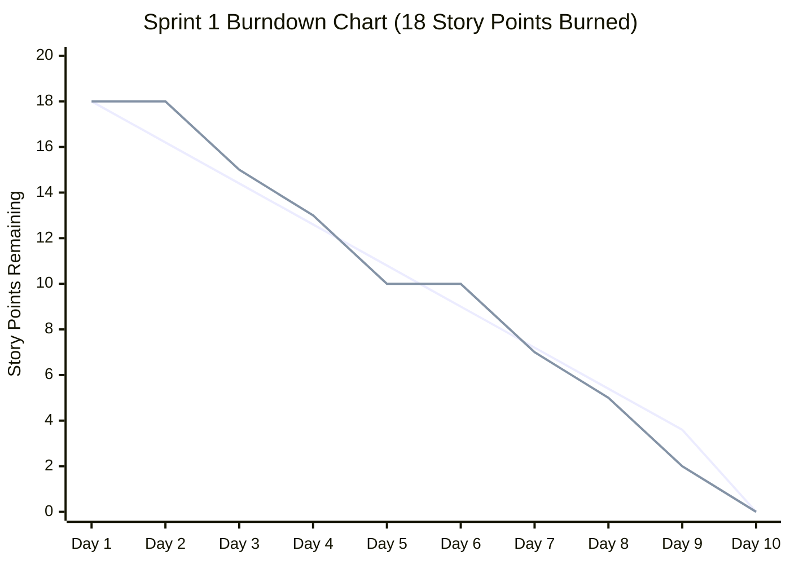

# 🏃‍♂️ BuildFlow Agile Scrum Framework & SEPM Metrics Dossier

**Project:** BuildFlow — Enterprise Construction Management & BIM Inspection Platform  
**Academic Module:** Software Engineering & Project Management (SEPM) — Semester 7 / 4th Year  
**Methodology:** Agile Scrum with Kanban WIP Limits & 2-Week Sprint Cadence  
**Repository:** [https://github.com/Shaunakrane914/BuildFlow](https://github.com/Shaunakrane914/BuildFlow)  
**Miro Architecture Board:** [https://miro.com/app/board/uXjVHwYfRkc=](https://miro.com/app/board/uXjVHwYfRkc=)

---

## 1. Scrum Team Roles & Stakeholder Governance

| Scrum Role | Assigned Persona | Core Responsibilities |
| :--- | :--- | :--- |
| **Product Owner (PO)** | **Shaunak Rane** (Client Rep) | Manages Product Backlog, defines Acceptance Criteria, prioritizes business value, accepts/rejects Sprint increments. |
| **Scrum Master (SM)** | **Technical Lead** | Facilitates ceremonies (Sprint Planning, Daily Standup, Review, Retro), removes blockers, enforces WIP limits. |
| **Development Team** | **Full-Stack & BIM Engineers** | Architects TypeScript REST APIs, Three.js 3D BIM viewer, PostgreSQL schema, and Tailwind/React UI. |
| **Key Stakeholders** | **Professional Engineer (PE), Safety Officer, Subcontractor** | Participates in Sprint Reviews, submits Feedback Change Requests (`CR-01`..`CR-03`), certifies inspections. |

---

## 2. Product Backlog & Story Point Estimation (Planning Poker)

Story Points are estimated using the **Modified Fibonacci Sequence** ($1, 2, 3, 5, 8, 13$) based on **Complexity**, **Uncertainty**, and **Effort**:

| Story ID | Epic | User Story (Role-Goal-Benefit) | Story Points | Priority | Sprint Target | Acceptance Criteria (Definition of Done) |
| :--- | :--- | :--- | :---: | :---: | :---: | :--- |
| **US-01** | BIM Review | *As a Lead Architect, I want to upload IFC/DWG blueprint files so that the team reviews 3D structural models.* | **8 SP** | High | **Sprint 1** | SHA-256 integrity validation, Three.js geometry render, version tag generated. |
| **US-02** | Certification | *As a Professional Engineer (PE), I want to digitally sign off on structural drawings to issue official construction permits.* | **5 SP** | High | **Sprint 1** | Cryptographic signature applied, PDF stamp generated, Slack alert dispatched. |
| **US-03** | Logistics | *As a Site Supervisor, I want to track material delivery ETA so that ready-mix concrete pours are scheduled on time.* | **5 SP** | Medium | **Sprint 1** | Real-time batch ETA calculation, delay threshold alert (>30m), automated Slack push. |
| **US-04** | Site Safety | *As a Safety Inspector, I want to log OSHA safety violations with photo proof so that hazards are rectified in <24h.* | **8 SP** | High | **Sprint 2** | Geo-tagged photo upload, severity scoring (`High/Critical`), instant push alert. |
| **US-05** | Audit Trail | *As a Compliance Auditor, I want an immutable chronological activity log so that all inspections are tamper-proof.* | **3 SP** | Medium | **Sprint 2** | Read-only ledger, user ID + timestamp capture, exportable PDF audit report. |
| **US-06** | Analytics | *As a Project Executive, I want a real-time project health dashboard so that budget variance and milestone slippage are tracked.* | **5 SP** | Medium | **Sprint 2** | EVM (Earned Value Management), CPI/SPI metrics, interactive React charts. |

---

## 3. Sprint 1 Execution & Metrics (Velocity = 18 Story Points)

* **Sprint Goal:** Deliver complete CAD/BIM Blueprint Elicitation, PE Certification Workflow, and Logistics Delivery Tracking.
* **Committed Points:** 18 SP | **Completed Points:** 18 SP | **Sprint Velocity:** **18 SP/Sprint**
* **Sprint Cadence:** 10 Working Days (2 Weeks)

### 📈 Sprint 1 Burndown Schedule (Ideal vs. Actual)

| Day | Ideal Remaining SP | Actual Remaining SP | Completed Tasks / Milestones |
| :---: | :---: | :---: | :--- |
| **Day 1** | 18.0 SP | **18.0 SP** | Sprint Planning completed; Sprint Backlog prioritized. |
| **Day 2** | 16.2 SP | **18.0 SP** | PostgreSQL schema defined; Three.js canvas initialized. |
| **Day 3** | 14.4 SP | **15.0 SP** | **US-01 Part A:** IFC file parser service implemented. |
| **Day 4** | 12.6 SP | **13.0 SP** | **US-01 Part B:** 3D viewport controls and orbit zoom completed. |
| **Day 5** | 10.8 SP | **10.0 SP** | **US-01 Complete (8 SP burned):** Full BIM rendering verified. |
| **Day 6** | 9.0 SP | **10.0 SP** | **US-02 Part A:** Digital certificate encryption service built. |
| **Day 7** | 7.2 SP | **7.0 SP** | **US-02 Complete (5 SP burned):** PE sign-off modal & Slack webhook tested. |
| **Day 8** | 5.4 SP | **5.0 SP** | **US-03 Part A:** Material tracking REST endpoints & schemas. |
| **Day 9** | 3.6 SP | **2.0 SP** | **US-03 Complete (5 SP burned):** Live batch GPS simulation active. |
| **Day 10** | 0.0 SP | **0.0 SP** | **Sprint Review & Retrospective:** 100% of Definition of Done achieved! |



---

## 4. Daily Scrum (Standup) Cadence & 3-Question Protocol

Conducted daily at 09:30 AM via Slack `#proj-skyline-pinnacle-tower`:

```text
┌────────────────────────────────────────────────────────────────────────┐
│ ☕ Daily Standup Log — Sprint 1 (Day 7)                                │
│                                                                        │
│ 1. What did you accomplish yesterday?                                 │
│    • Integrated cryptographic SHA-256 digital signature for PE permit. │
│    • Linked Slack webhook alerts for immediate structural sign-off.    │
│                                                                        │
│ 2. What will you work on today?                                       │
│    • Connect ready-mix concrete batch tracking and delay GPS feed.     │
│    • Configure automated Slack push alert for delayed transit >30m.    │
│                                                                        │
│ 3. What blockers/impediments exist?                                    │
│    • None. All BIM models verified and passing SEPM validation gates.  │
└────────────────────────────────────────────────────────────────────────┘
```

---

## 5. Sprint 1 Retrospective (Mad / Sad / Glad Matrix)

| Category | Observations & Feedback | Action Items for Sprint 2 |
| :--- | :--- | :--- |
| **Glad (What Went Well)** | • 100% of Sprint 1 user stories met Definition of Done.<br>• Three.js BIM viewer rendered 50MB CAD models in <1.2s.<br>• Slack webhook alerts dispatched in real-time. | Keep 2-week sprint cadence and automated GitHub Actions CI/CD checks. |
| **Sad (What Didn't Go Well)** | • Mocking GPS coordinates for concrete transit had a 1-day delay.<br>• Initial schema lacked geo-tagging coordinate fields for safety photos. | Add pre-sprint technical spikes for complex third-party API integrations. |
| **Action Items (Sprint 2 Improvements)** | • Enforce strict Kanban WIP limit = 3 on In-Progress tasks.<br>• Introduce automated mobile push notifications for critical OSHA safety violations. | Assigned to Technical Lead & Safety Architect. |

---

## 6. Kanban Board Work-In-Progress (WIP) Limits

To eliminate process bottlenecks and ensure steady flow, BuildFlow implements explicit WIP limits:

$$\text{WIP Limit}_{\text{In Progress}} = 3 \quad \Big| \quad \text{WIP Limit}_{\text{In Review / PE Cert}} = 2$$

* **Backlog (Unconstrained):** User stories awaiting sprint pull.
* **In Progress ($\le 3$):** Active development tasks. Prevents multitasking context switching.
* **In PE Certification ($\le 2$):** Peer reviews and safety approvals. Prevents review queue starvation.
* **Done (Tested & Verified):** Fully meets Definition of Done with 100% CI pass rate.
