```mermaid
flowchart TD
    classDef req fill:#1e3a8a,stroke:#3b82f6,stroke-width:2px,color:#fff;
    classDef analysis fill:#065f46,stroke:#10b981,stroke-width:2px,color:#fff;
    classDef design fill:#854d0e,stroke:#eab308,stroke-width:2px,color:#fff;
    classDef uml fill:#581c87,stroke:#a855f7,stroke-width:2px,color:#fff;
    classDef devops fill:#991b1b,stroke:#ef4444,stroke-width:2px,color:#fff;

    subgraph STAGE1 ["STAGE 1: REQUIREMENTS ELICITATION & PROBLEM DEFINITION"]
        A1["1. Problem Definition<br/>(Schedule Delays & Blueprint Bottlenecks)"]:::req --> A2["2. Stakeholder Identification<br/>(8 Construction Roles)"]:::req
        A2 --> A3["3. Elicitation Techniques"]:::req
        
        subgraph ELICITATION ["3-Pillar Elicitation Methods (Syllabus Mandate)"]
            A3_1["3A. Structured Interviews<br/>(PM & Engineer Workflow Bottlenecks)"]:::req
            A3_2["3B. User Questionnaires<br/>(Supplier Delivery Frequencies & Utilities)"]:::req
            A3_3["3C. Brainstorming Session<br/>(Dot Voting & Centralized Hazard Matrix)"]:::req
        end
        A3 --> A3_1 & A3_2 & A3_3
    end

    subgraph STAGE2 ["STAGE 2: ANALYSIS & SYSTEM SPECIFICATION"]
        A3_3 --> B1["4. Feasibility Study<br/>(Technical, Economic, Operational)"]:::analysis
        B1 --> B2["5. Requirement Analysis & IPO<br/>(Inputs, Processes, Outputs, Constraints)"]:::analysis
        B2 --> B3["6. Data Flow Diagrams (DFD)"]:::analysis
        
        subgraph DFD_LAYERS ["DFD Hierarchy"]
            B3_0["DFD Level 0 Context Diagram<br/>(External Entities <-> BUILDFlow System)"]:::analysis
            B3_1["DFD Level 1 Process Breakdown<br/>(P1 Project, P2 Task, P3 Design, P4 Material, P5 Inspection)"]:::analysis
        end
        B3 --> B3_0 --> B3_1
        
        B3_1 --> B4["7. Data Dictionary<br/>(Data Elements, Types, Sources & Destinations)"]:::analysis
        B4 --> B5["8. SRS Specification Document<br/>(FR-01..10, NFR-01..04, Acceptance Criteria)"]:::analysis
    end

    subgraph STAGE3 ["STAGE 3: EVOLUTIONARY PROTOTYPING & REFINEMENT LOOP"]
        B5 --> C1["9. Quick Design (WF1, WF2, WF3)<br/>(Low-Fidelity Wireframes)"]:::design
        C1 --> C2["10. Interactive React Prototype<br/>(Working Monorepo SPA Application)"]:::design
        C2 --> C3["11. Stakeholder Evaluation<br/>(Owner, PM, PE, Contractor Review)"]:::design
        C3 --> C4["12. Feedback Analysis Matrix<br/>(Raw Comments -> Change Requests CR-01..03)"]:::design
        C4 --> C5["13. Refinement Decision & Design Freeze<br/>(Approved Baseline Handoff)"]:::design
    end

    subgraph STAGE4 ["STAGE 4: FORMAL OBJECT-ORIENTED MODELING (9 UML DIAGRAMS)"]
        C5 --> D0["14. Handoff to Formal UML Engine"]:::uml
        
        subgraph STRUCTURAL_UML ["Structural Models (4 Diagrams)"]
            D1["1. Class Diagram<br/>(BaseEntity Inheritance, Stereotypes, Realization)"]:::uml
            D2["2. Object Diagram<br/>(Runtime Static Snapshots & Instances)"]:::uml
            D3["3. Component Diagram<br/>(IRestApi & IDatabase Lollipop Interfaces)"]:::uml
            D4["4. Deployment Diagram<br/>(Hardware Topology, Node Execution Envs)"]:::uml
        end

        subgraph BEHAVIORAL_UML ["Behavioral Models (5 Diagrams)"]
            D5["5. Use Case Diagram<br/>(Primary Actors, include & extend)"]:::uml
            D6["6. Sequence Diagram<br/>(Alt/Else Execution Fragments)"]:::uml
            D7["7. Collaboration Diagram<br/>(Isomorphic Object Interaction Links)"]:::uml
            D8["8. Statechart Diagram<br/>(Task & Material Entry/Exit States & Guards)"]:::uml
            D9["9. Activity Diagram<br/>(7 Stakeholder Swimlanes & Concurrency)"]:::uml
        end
        
        D0 --> STRUCTURAL_UML & BEHAVIORAL_UML
    end

    subgraph STAGE5 ["STAGE 5: COLLABORATION, CI/CD & DEVOPS DEPLOYMENT"]
        STRUCTURAL_UML & BEHAVIORAL_UML --> E1["15. Team Collaboration (Slack)<br/>(6 Channels, Interactive Buttons, Webhooks)"]:::devops
        E1 --> E2["16. Version Control (GitHub)<br/>(SCM Commit History & Code Repository)"]:::devops
        E2 --> E3["17. CI/CD Quality Gate (Jenkins)<br/>(5-Stage Pipeline, 8 Vitest Integration Suites)"]:::devops
        E3 --> E4["18. Production Staging Release"]:::devops
    end
```

# 🗺️ Complete SEPM Presentation Flowchart & Audit Execution Master Plan
**Course:** Software Engineering & Project Management (`SKD5.52001`)  
**Target Evaluation:** Universal AI University — SEPM Practical Viva & Portfolio Review  

---

---

## 🛠️ Detailed Breakdown of the 5 Audit Gap Fixes

### 1. 💡 Brainstorming Session Added (Section 3C)
* **Objective:** Fulfills Mam's 3-pillar elicitation mandate (`Interviews` + `Questionnaires` + `Brainstorming`).
* **Methodology:** 4-hour joint discovery session with PM Alex, Architect Sophia, Structural PE Marcus, and Contractor David.
* **Outputs Produced:**
  - **Dot Voting Prioritization:** 18 sticky ideas clustered into 3 core priorities.
  - **Centralized Hazard Matrix:** Identified early risk of port customs holds on Grade 60 steel rebar.

---

### 2. 📱 Interactive React Prototype (Section 10)
* **Objective:** Fulfills the evolutionary/spiral prototyping requirement.
* **Demonstration Credentials:**
  - **URL:** Running locally via Vite at `http://localhost:5173`
  - **Login Persona:** `alex.pm@buildflow.dev` (Project Manager)
* **Key Interactive Features:**
  - **Interactive Kanban Board:** Drag-and-drop tasks across `BACKLOG`, `TODO`, `IN_PROGRESS`, `IN_REVIEW`, `DONE`.
  - **CAD Blueprint Viewer Modal:** Version comparison (`v1.0` vs `v2.1`) with PE calculation sign-off status.
  - **Supply Chain Tracker:** Real-time logistics alert flagging `REQ-101` (Steel Rebar) as `DELAYED`.

---

### 3. 🔍 Feedback Analysis Matrix (Section 12)
* **Objective:** Connects raw stakeholder evaluation comments into explicit software Change Requests (CRs).
* **Change Request Mapping:**
  - **CR-01 (Architect Feedback):** Add revision history comparisons for CAD drawing uploads $\rightarrow$ Added to `DesignDocument` model.
  - **CR-02 (Structural PE Feedback):** Require mandatory calculation remarks field before certifying approval $\rightarrow$ Added `DesignReview.calculationRemarks` field.
  - **CR-03 (Contractor Feedback):** Send real-time Slack alert when material delivery is delayed $\rightarrow$ Integrated Slack Webhook trigger.

---

### 4. 🔀 DFD Level 0 Context & Level 1 Process Verification (Section 6)
* **DFD Level 0 (Context Diagram):**
  - Single central process: `0. BUILDFlow System`
  - External Entities: `Project Owner`, `Project Manager`, `Architect`, `Structural PE`, `General Contractor`, `Site Supervisor`, `Supplier`, `Inspector`.
* **DFD Level 1 (Detailed Subsystem Processes):**
  - `P1.0`: Project Management & Progress Engine
  - `P2.0`: Milestone Task & Kanban Scheduler
  - `P3.0`: CAD Blueprint & PE Review Manager
  - `P4.0`: Material Supply Chain & Logistics Engine
  - `P5.0`: Safety Inspection & Defect Ticket Manager
  - `P6.0`: Executive Analytics & Audit Logger

---

### 5. 📐 Full 9 UML Formal Notation Enhancements (Section 14)
* **Generalization (Inheritance):** Base parent entity `BaseEntity <|-- User`, `Project`, `Task`, `DesignDocument`, `Material`, `Inspection`, `Issue`, `ActivityLog`.
* **Realization:** `IAuditService <|.. AuditLogger` interface realization and `IRestApi`, `IDatabase` lollipops in Component diagram.
* **7 Stakeholder Swimlanes in Activity Diagram:** `|Project Owner|`, `|Project Manager|`, `|Architect|`, `|Structural Engineer|`, `|Material Supplier|`, `|General Contractor|`, `|Safety Inspector|`.
* **Extensibility Mechanisms:** Enriched with `<<entity>>`, `<<boundary>>`, `<<control>>`, `<<primary_actor>>` stereotypes, `{budget > 0}` constraints, and `{author = "Marcus PE"}` tagged values.
* **Use Case `<<include>>` & `<<extend>>`:** Included audit logging and extended defect escalation.
* **Sequence Alt/Else Fragments:** Conditional branching for PE calculation verification (Passed vs Failed).

---

## 🎯 Final Presentation Defense Script for Mam

> *"Mam, our project demonstrates the complete Software Engineering lifecycle from initial elicitation to cloud deployment.  
> 
> In **Stage 1**, we conducted Elicitation using **Interviews, Questionnaires, and Brainstorming**, produced **DFD Level 0 and Level 1**, built a **Formal Data Dictionary**, and authored the **SRS Document**.  
> 
> In **Stage 2**, we created Quick Design wireframes, built an **Interactive React Prototype**, evaluated stakeholder feedback, and translated raw comments into Change Requests `CR-01` through `CR-03`.  
> 
> In **Stage 3**, we handoff to **9 Formal UML Models** fully enriched with **Generalization inheritance trees, Realization contracts, 7 Stakeholder Swimlanes, and Extensibility Stereotypes**.  
> 
> Finally, in **Stage 4 & 5**, we show **Slack Team Collaboration**, **GitHub Version Control**, and **5-Stage Jenkins CI/CD Quality Gates** verifying our test suite before release!"*
